# Estudio sobre el impacto de la relación entre el consumo energético y generación de CO2 a nivel global

## Definición del problema
La actividad humana es la principal fuente de emisiones de gases de efecto invernadero. Siendo dos tercios, de estas actividades, la quema de combustibles fósiles para calefacción, electricidad, transporte e industria (EEA). 

Con el rápido crecimiento poblacional, y la alta necesidad de generación de energía, se produjo que el cambio climático se ha acelerado en las últimas décadas. Principalmente, desde 1990 donde se observó el aumento al 52.74% de emisiones a nivel mundial (COES, 2020).

## Objetivos 
### Objetivo principal:
- Determinar cómo es la relación entre el consumo energético y la emisión de CO2 en el medio ambiente.
### Objetivos secundarios:
- Implementar un Data Lake en la nube para juntar la data entregada.
- Automatizar los procesos de ETL.
- Construir un Data Warehouse para la ONU.
- Determinar los cinco países con mayor emisión de CO2.
- Determinar la emisión de CO2 por tipo de fuente de energía
- Determinar la brecha de la huella de carbono
- Determinar el KWh consumido per cápita
- Determinar la brecha entre la energía producida y consumida
- Determinar el CO2 emitido por KWh producido
- Contrastar el crecimiento de la población y de las emisiones de CO2 per cápita
- Identificar los países que han tenido mayor migración a energías renovables
- Crear dashboard para mostrar los KPIs para la toma de decisiones
- Implementar modelo de machine learning  para predecir emisiones de CO2 y consumo energético para el 2030 (Tratado de Paris)

## KPI’s y métricas
### Niveles de contaminación por carbono
- Brecha de la Huella de Carbono (Carbon Footprint).
### Fuente de energía más contaminante
- Emisión de CO2 por fuente energética.
### Contaminación por población
- Emisiones de CO2 per cápita.
- KWh consumido per cápita.
### Consumo mundial de electricidad post Tratado de Paris y COVID-19
- Consumo eléctrico por continente (Tratado de París).
- Variación del consumo eléctrico (COVID-19).

## Procesamiento de datos
### Reconocimiento de fuentes de información
Datasets: 

- energyco2.csv,global_power_plant_database.csv, owid-energy-consumption-source.csv
URL: https://github.com/soyHenry/proyecto_grupal_consumo_energ-a_co2
- owid-co2-data
URL: https://raw.githubusercontent.com/owid/co2-data/master/owid-co2-data.csv

### Limpieza de datos
Para nuestro proceso de limpieza, comenzamos por delimitar los datos a nuestro alcance, tomando en cuenta los años mayores a 1980.

En segunda instancia realizamos una inspección de cada uno de los datasets, seleccionando columnas de interés para nuestro análisis posterior, luego procedemos a imputar los datos, de igual forma se encuentra columnas que muestran valores redundantes (ej. 'Republic North Korea' o 'North Kore') por lo que se procede a convertirlos a un solo valor uniforme, y este mismo caso sucede en otras columnas de valores como el de los tipos de fuentes de energía. Y para el resto de los datos se aplican los puntos importantes para corregirlos como:
- Columnas no relevantes
- Valores nulos
- Valores duplicados
- Reemplazo de comas
- Tipo de dato de la columna

esto para evitar problemas en la ingesta de los datos a Mysql. 

### Calidad de los datos
Luego de la limpieza de los datos, se procede a normalizar los nombres de columnas, de tal manera coincida y sea la misma en todas las tablas, posterior procedemos a modelar la estructura relacional que tendrá nuestros datos en el Datawarehouse. Hasta ahora se cuenta con 4 tablones, los cuales serán normalizados hasta alcanzar la Tercera Forma Normal, y se alcanza de la siguiente manera:
- Primera Forma Normal: Una relación se encuentra en 1FN sólo si cada uno de sus atributos contiene un único valor para un registro determinado.
- Segunda Forma Normal: Una relación se encuentra en 2FN sólo si se cumple 1FN y todos sus atributos no clave dependen en forma completa de la clave.
- Tercera Forma Normal: Una relación se encuentra en 3FN sólo si se cumple 2FN y los campos no clave dependen únicamente de la clave o los campos no clave no dependen unos de otros.

***Procedimiento:***

- 1FN en los datos: Nuestras tablas principales cumplen con la 1FN 
- 2FN en los datos: Esto no se cumple, por ende, se procede a realizar separación de tablas.
  - Tablón energyco2: Se genera la separación de la tabla source_energy_1:
    - source_energy_1 (source)
    - region (idRegion, region)
  - Tablón energy_consumption_source: Se genera la separación de la tabla source_energy_2:
    - source_energy_2 (source)
- 3FN en los datos: Esto no se cumple, por ende, se procede a realizar separación de tablas.
  - Tablón energyco2: Se genera la separación en 3 tablas:
    - emission (country, source, year, co2emissions)
    - source_country_electricity_energyco2 (country, source, year, consumptionElectricity, productionElectricity)
  - Tablón energy_consumption_source: Se genera la separación en 3 tablas:
    - population_country_electricity (country, source, year, electricityDemand, electricityGeneration, population)
    - source_country_electricity_consumption (country, source, year, consumptionElectricity, energyPerCapita, elecPerCapita)
    - country (idCountry, iso_code, country)
    - energy_consumption_region (region, source, year, co2emissions)
    - source_region_electricity (region, source, year, consumptionElectricity, energyPerCapita, elecPerCapita)	

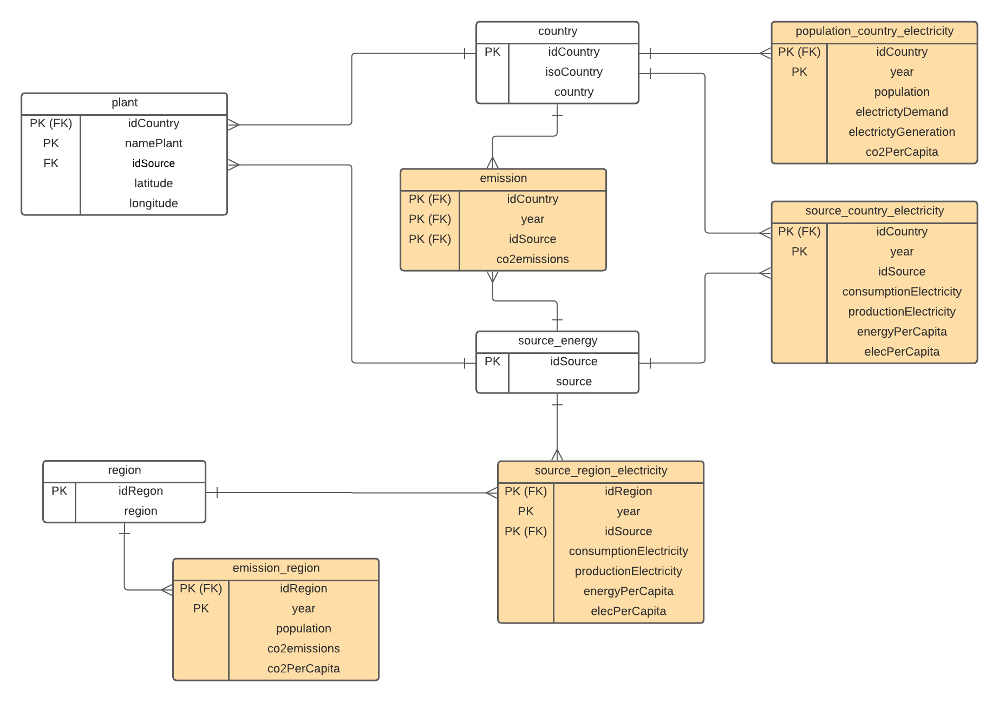

## Arquitectura implementada 

La arquitectura empleada para el proceso de ETL se basa en el lenguaje Python y SQL en conjunto con los servicios de la nube de AWS.

Una vez que se tuvo las tablas definidas, así como sus campos y conexiones (llave primarias y secundarias) se creó en la nube de AWS una database en el servicio RDS. Para luego conectar mediante un punto de acceso y crear una instancia en el MySQL. En la database, creada en la nube, se crea la estructura de las tablas con sus llaves primarias y secundarias. Con ello, poder generar la conexión con el editor de código y poder subir los datos limpios al database del servicio RDS.
Para poder guardar cada tabla en el almacenamiento de la nube, se creó un bucket en el servicio Amazon S3. Esto se realizó para cada tabla mediante el servicio Data Pipeline, el cual creaba un archivo csv mediante una tarea de única vez filtrado por la última fecha.

Para la carga incremental, se creó otro pipeline que se ejecutaba cada día y generaba un archivo csv incremental únicamente para las tablas de hechos. Este pipeline filtraba la carga con la última fecha de las tablas. 
Para unir la carga incremental y la carga inicial, se generó un clúster en el servicio Amazon Redshift en el cual las tablas de hechos tenían una tabla de carga inicial y otro de carga incremental. En la tabla de carga inicial se ingestaba los datos de los csv que estaban en el bucket. Para poder subir los datos de los archivos csv de carga incremental a la tabla de cargas incrementales al clúster se creó Jobs del servicio AWS Glue, con lo cual se cargaban los datos a la tabla incremental del clúster y se agregaba a la tabla inicial asegurándose que no se repitan llaves primarias. 

Para que el Job se ejecutara cuando se insertaba un nuevo archivo csv en las carpetas de carga incremental, se creó un Lambda. El cual cuando detectaba alguna inserción y/o modificación en este csv disparaba el Job correspondiente.
Con este proceso se tiene un datawarehouse actualizado en el clúster creado en el Amazon Redshift.

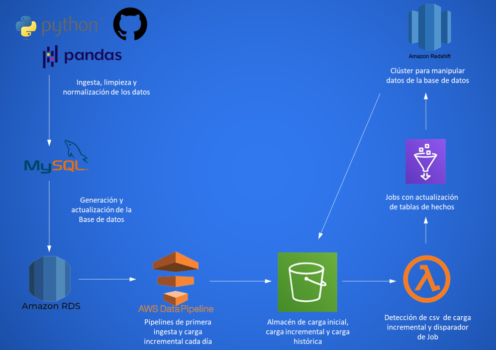

## Dashboard
### Página 1.
***Niveles de contaminación por CO2***

A partir de lo mencionado, se le puede atribuir parte de la responsabilidad del aumento del CO2 a nivel mundial, a China, quien a la par, ah demostrado en las últimas dos décadas, un aumento es su economía, siendo reconocido a nivel mundial. Esta responsabilidad también es atribuida a ella, ya que si comparamos los números de plantas de generación eléctrica por país, podemos observar que Estados Unidos posee más del doble de fábricas que China, y aún así, esta produce cerca del doble de CO2 que Estados Unidos, por lo que probablemente no se este supervisionando adecuadamente las plantas de generación eléctrica, y un poco incentivo en energías más renovables.

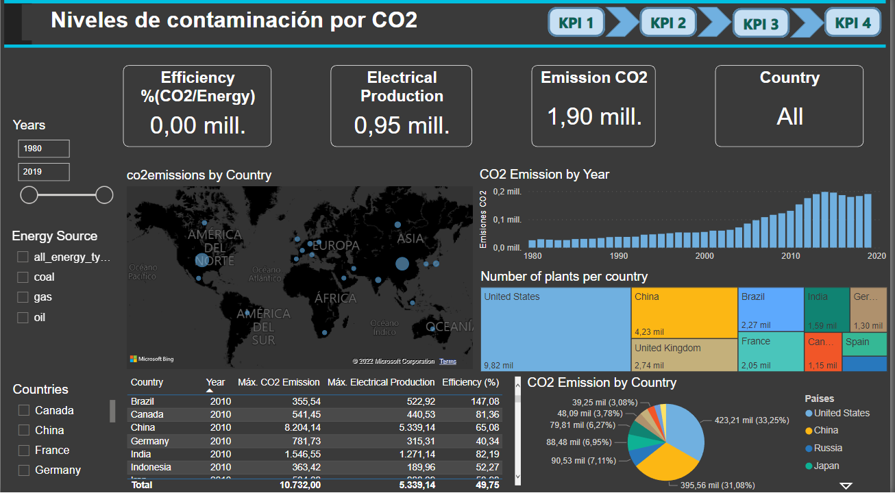

### Página 2.
***Emisiones de CO2 por región***

Las emisiones del grupo G20 son muy cercanas a las emisiones a nivel mundial, es decir que una agrupación de 20 países contaminan más que cualquier continente, esto mismo se puede deber a que este grupo es muy activo dentro de las industrias y al nivel poblacional de estos países.

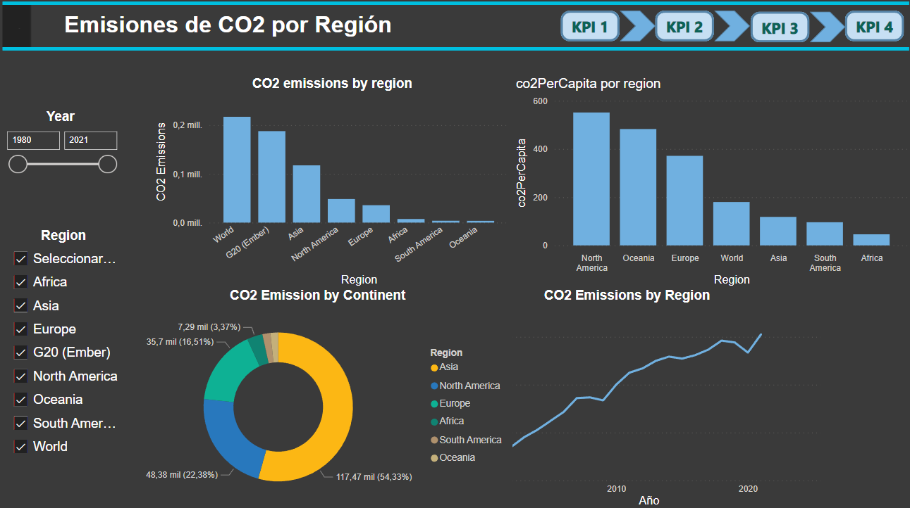

### Página 3.
***Emisiones de CO2 por fuente de energía y país.***

 la fuente que mayor contaminación genera es el carbón, seguido por el petróleo. En este caso es interesante ver como los 2 países con mayor emisión de CO2 son China y Estados Unidos, países que nos permiten ver por qué Norteamérica y Asia son de los continentes que más emisiones de CO2 generan. De la misma manera ambos países se encuentran dentro del grupo G20

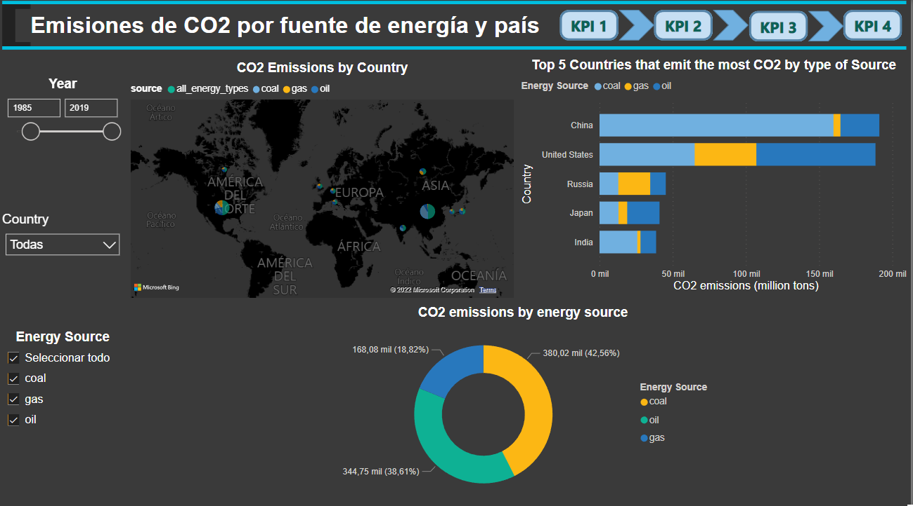

 ### Página 4.
***CO2 por habitante***

 los países con mayores niveles de CO2 per cápita son países que no se presentan entre los 10 países con mayores niveles de emisión de CO2 ni producción de energía eléctrica. No hay un motivo claro para tales índices, sin embargo, como dentro de estos países de los Emiratos Árabes, existe el histórico de exportación de petróleo, se podría deducir, que el alto CO2 per cápita, es por el país depender principalmente de esta fuente de energía, que es la menos eficiente en términos de generación eléctrica, por lo que necesita consumir altos niveles de combustible para abastecer los ciudadanos, pese a su población no estar entre las más pobladas del planeta.

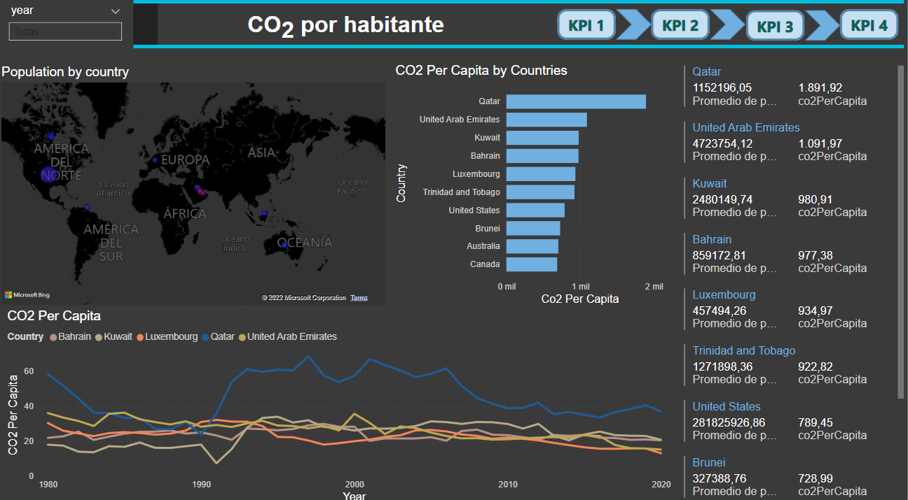

 ### Página 5.
***KWh por habitante***

en cuanto al consumo de electricidad per cápita por países, los países europeos nórdicos tienden a aparecer entre los principales consumidores. Contradictoriamente, ninguno de estos países se presenta entre los principales emisores de CO2, por lo que se deduce que poseen una gran eficiencia en su producción eléctrica, por ejemplo, las plantas de energía geotérmica que están presentes en paises como Islandia. 
Por otro lado, el alto consumo de energía eléctrica en los emirados árabes puede darse por el alto transito turístico y empresarial presentes en la región, sumado a las altas temperaturas que perduran durante todo el año.

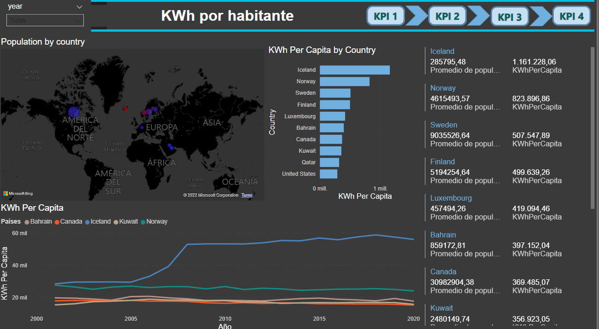

 ### Página 6.
***Consumo nacional de electricidad***

Si bien los indices de los últimos 40 años nos muestran a Estados Unidos como el principal consumidor de energía eléctrica, China lo equipara a partir de 1995 y termina superandolo en los años posteriores, llegando hasta a un 71% a más de consumo que Estados Unidos para el año de 2019.

En relación a la fuente de energía de las principales emisores (China y Estados Unidos), observamos que para China su principal fuente es el carbón, que se demuestra de un 40 a 50% más contaminante que el gás natural, el cual es cerca de 14.5% del consumo en relación al carbón, y el petroleo se presenta como la segunda principal fuente de energía, si bien en menor cantidad en relación al carbón, aún así el gas se presenta un 41.2% del consumo en relación al petroleo.

Si comparamos estas fuentes de energía con las de Estados Unidos, podemos ver que si bien este presenta como principal fuente eléctrica el petroleo, no llega a ser más que un 16% que el gas natural.

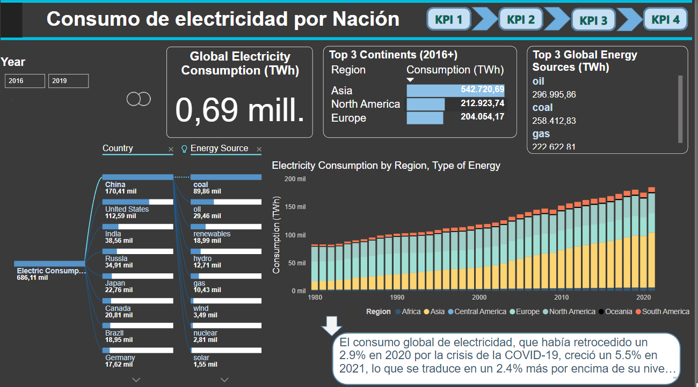

***CONCLUSIONES***
- Los países que más emiten, están entre los que presentan menor eficiencia.
- El crecimiento de emisiones de CO2 de China es el mayor del mundo.
- El carbón es la fuente de energía que más contamina.
- El consumo de CO2 y de electricidad per cápita es desproporcionado al consumo absoluto.
- Necesidad de fuentes de energías más adaptables
- El petróleo y otros líquidos es la fuente de energía más consumida post Tratado de París.

## Modelo forecast: Red Neuronal Artificial Multicapa 

### Contexto

Teniendo en cuenta que puede haber una relación no lineal entre los indicadores de crecimiento económico y las emisiones de CO2, desarrollamos un modelo de red neuronal artificial multicapa (MLANN). Un modelo de red neuronal artificial multicapa es más eficiente para capturar la no linealidad presente en los datos de la serie temporal y proporciona una mayor precisión en la previsión de las emisiones de CO2 en función de los valores anteriores de las emisiones y los indicadores económicos.

El periodo de estudio es del 1980 al 2020, considerándose como análisis inicial dos tipos de países, cuya selección de países en este estudio se basa en los datos recopilados del presente proyecto y siguiendo como guía de ejemplo estimaciones de emisiones de dióxido de carbono por la Agencia Internacional de Energía (IEA)

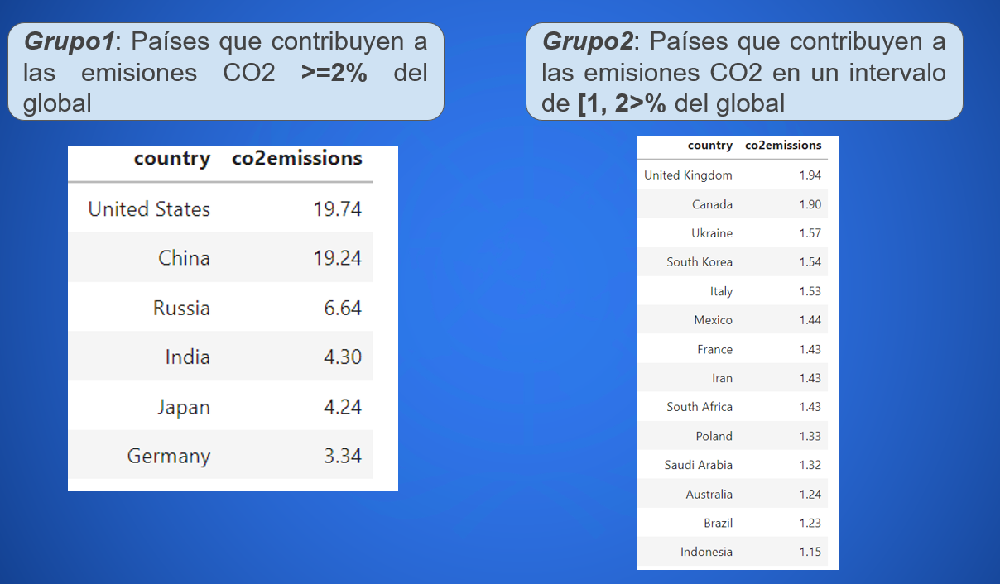

### Entradas y Salidas
- **inputs:** co2PerCapita(Tn), Population, gdp($), energyProduction(TWh)
- **output:** co2emission(Tn), Intentamos pronosticar los niveles de emisión de CO2 de 20 países que representan casi el 82.3% de las emisiones globales, cuyos pronósticos serás del 2021 hasta el 2030 (Tratado de parís)

### Arquitectura

***Hiperparámetros :***
- Funcion de activacion: 
  - hidden: tanh
  - output: linear
- Optimizador: Adam
- Learning rate: 0.1
- Función de pérdida: MAE
- Inicialización de parámetros:
  - weights: GlorotUniform
  - bias: RandomUniform entre -0.5 y 0.5
- Métricas: MAPE, MAE, RMSE
- Capa de entrada: 4 neuronas
- Capa oculta: Una con 9 neuronas y otra con 5 neuronas
- Capa de salida: 1 neurona

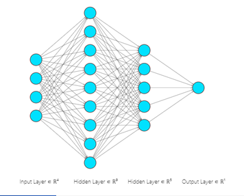

### Preprocesamiento

Se procesaron 137 países(los que tienen mayor cantidad de datos completos), en el caso de tener cantidades no registradas se realiza una imputación multivariante como IterativeImputer(estimator = DecisionTreeRegressor)

No se posee datos completos sobre las variables dependientes(inputs) hasta el horizonte del año 2030, por lo que se utiliza un modelo de proyección basado en la convolución 1D, el cual será utilizado en las proyecciones de cada feature

***Hiperparámetros:***
- window: 10 años
- horizon: 10 años
- epochs: 100
- callbacks: EarlyStopping
- loss: mae
- optimizador: Adam
- Learning rate: 0.01
- Conv1D: 32 filtros de forma (3, ) , relleno “causal", activación "relu"

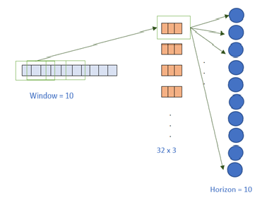

### Entrenamiento

La división de datos se dio de un 85% para el entrenamiento y un 15% para la prueba
Se aplicó un entrenamiento de 100 epochs, más la ejecución de un callback ModelCheckpoint, el cual a través de cada epoch nos permite guardar en una carpeta el mejor modelo que minimiza la función de pérdida de la validación.

### Prueba

Se efectuó la prueba sobre los modelos entrenados correspondientes a las series temporales de cada país perteneciente a los grupos de estudio 1 y 2, obteniéndose: 

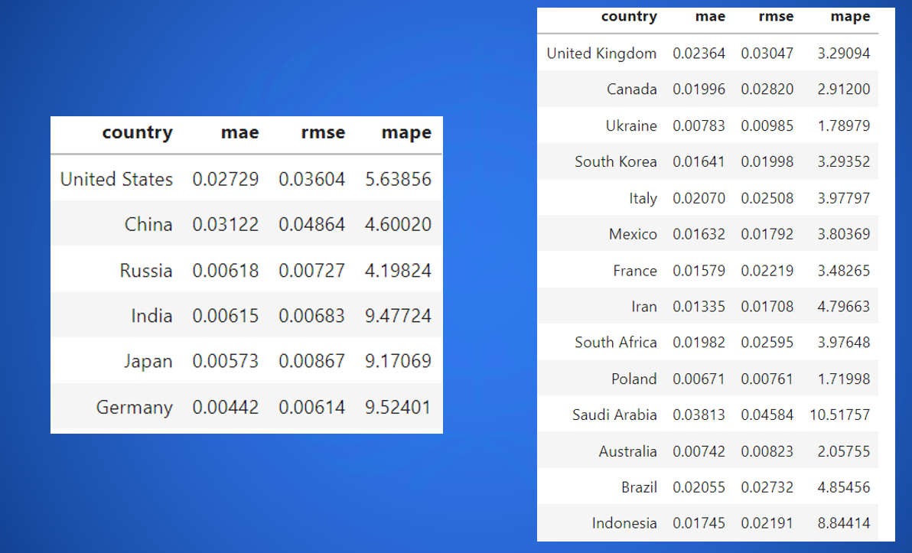

### Pronóstico

Finalizado las pruebas correspondientes y la elección de un buen modelo por cada serie temporal de país, se obtuvieron los siguientes pronósticos para un horizonte de 10 años (hasta el 2030)

Tomaremos como ejemplos los 2 primeros países de cada grupo.

***Grupo 1***

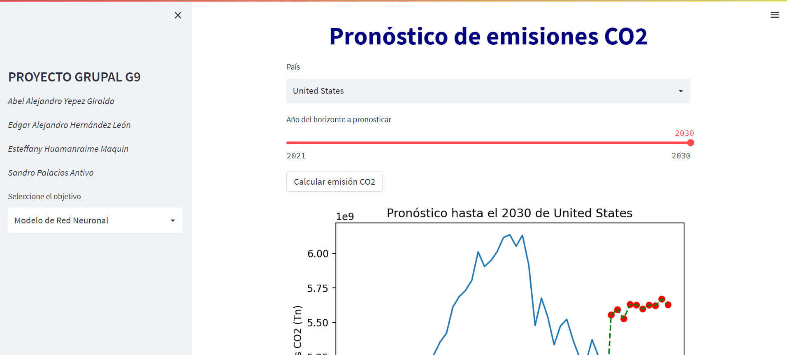

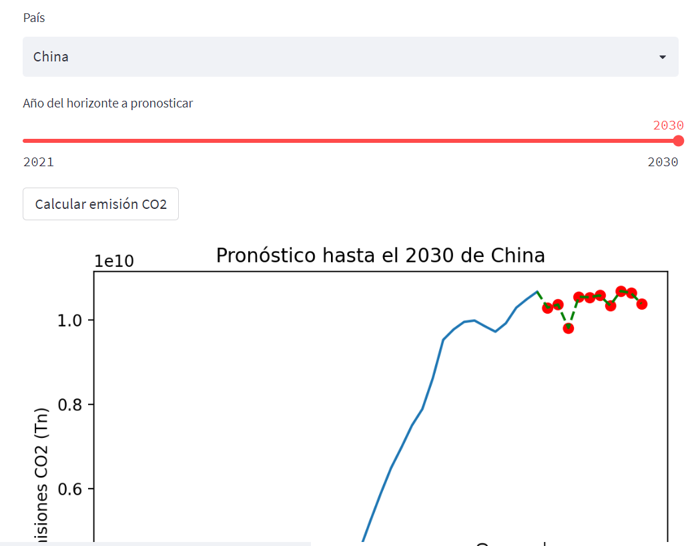

***Grupo 2***

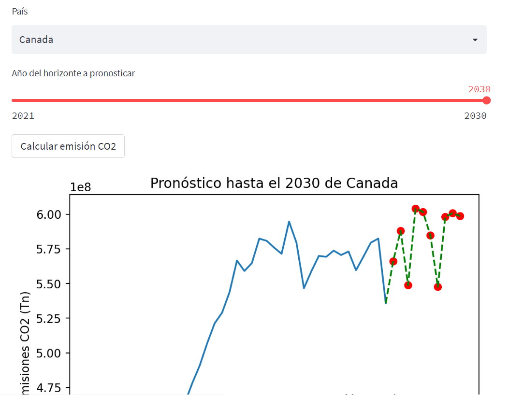

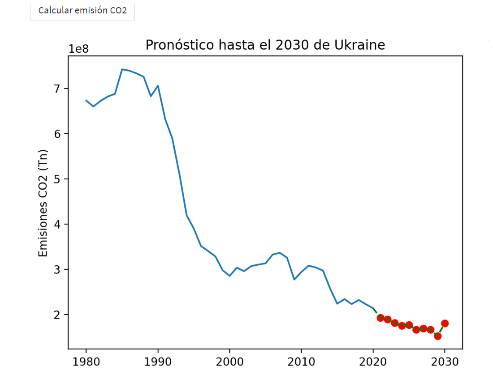
